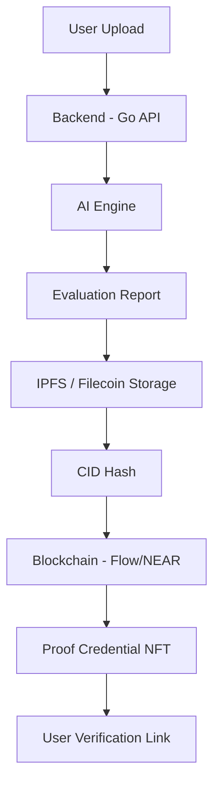
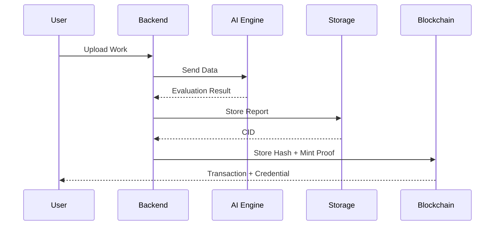
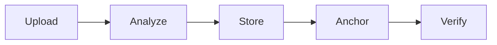
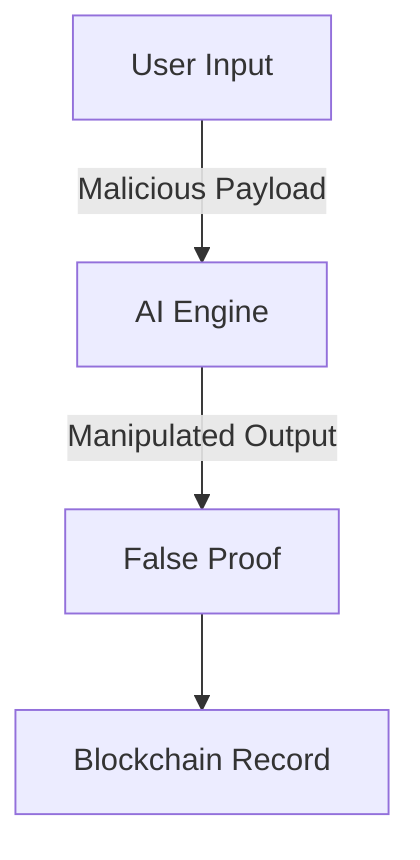

# Proof-of-Skill AI (PoSA)

### AI-Verified Work. Blockchain-Trusted Proof

[](LICENSE)

---

## Table of Contents

- [Overview](#overview)
- [Problem Statement](#problem-statement)
- [Solution](#solution)
- [Architecture](#architecture)
- [Orchestration Flow](#orchestration-flow)
- [Project Structure](#project-structure)
- [Implementation Strategy](#implementation-strategy)
- [Getting Started](#getting-started)
- [How to Use](#how-to-use)
- [Example Runs](#example-runs)
- [Security](#security)
- [CI/CD & Automations](#cicd--automations)
- [Use Cases](#use-cases)
- [Future Enhancements](#future-enhancements)
- [Contributing](#contributing)
- [License](#license)

---

## Overview

Proof-of-Skill AI (PoSA) is a decentralized system that uses **Artificial Intelligence** to evaluate user-submitted work (code, writing, tasks) and **Blockchain** to issue tamper-proof, verifiable credentials.

It addresses the growing problem of trust in digital work, freelancing, and online credentials — bridging the gap between skill and trust in the digital economy.

---

## Problem Statement

- Fake portfolios and unverifiable claims plague hiring pipelines
- No standardized, trusted proof of real skills exists
- Assessing remote talent remains difficult and subjective
- Security audits lack transparency and immutability

---

## Solution

PoSA introduces a pipeline where:

1. **AI evaluates** submitted work (code quality, security, logic)
2. **Reports are stored** on decentralized storage (IPFS/Filecoin)
3. **A cryptographic hash (CID)** is recorded on-chain
4. **A verifiable credential** (NFT or proof record) is issued to the user

---

## Architecture



### Components

| Component | Technology | Responsibility |
|---|---|---|
| **Frontend** | React / Next.js | Upload interface, displays AI evaluation results |
| **Backend** | Go | Handles submissions, orchestrates AI → Storage → Blockchain |
| **AI Engine** | Python | Code analysis, writing evaluation, score + explanation generation |
| **Storage** | IPFS / Filecoin | Stores evaluation reports, returns CID |
| **Blockchain** | Flow / NEAR | Stores CID hash, mints proof credential (NFT) |

---

## Orchestration Flow



**Simplified workflow:**



---

## Project Structure

```txt
posa/
├── backend/
│   ├── main.go              # API entrypoint
│   ├── handlers/            # HTTP route handlers
│   ├── services/            # Business logic (AI, IPFS, blockchain)
│   └── blockchain/          # Chain interaction layer
├── frontend/
│   ├── src/
│   └── components/          # UI components
├── contracts/
│   └── proof.cdc            # Smart contract (Flow) / proof.rs (NEAR)
├── ai/
│   └── evaluator.py         # AI evaluation engine
├── .gitignore
├── LICENSE
├── SECURITY.md
└── README.md
```

---

## Implementation Strategy

The project is built in **six incremental phases**:

### Phase 1 — Backend API (Go)

- REST API to accept file uploads and repo links
- Input validation and sanitization layer

### Phase 2 — AI Engine (Python)

- Code quality analysis (bugs, security vulnerabilities, logic correctness)
- Writing evaluation (quality, originality)
- Scoring system (0–100) with detailed explanations

### Phase 3 — Decentralized Storage

- IPFS/Filecoin integration for report persistence
- CID generation and retrieval

### Phase 4 — Blockchain Anchoring

- Smart contract deployment (Flow or NEAR)
- CID hash written on-chain, credential minted

```cadence
pub contract Proof {
    pub struct Credential {
        pub let cid: String
        pub let score: Int
    }
}
```

### Phase 5 — Frontend

- Upload interface (file, paste, GitHub link)
- Real-time AI feedback display
- Proof minting and verification UI

### Phase 6 — Integration & Hardening

- End-to-end pipeline testing
- Security audits, input fuzzing, contract verification

---

## Getting Started

### Prerequisites

- [Go](https://go.dev/) (1.21+)
- [Node.js](https://nodejs.org/) (18+)
- [Python](https://www.python.org/) (3.10+)
- IPFS node or [web3.storage](https://web3.storage/) API token (Filecoin)
- Blockchain SDK (Flow CLI / NEAR CLI)

### Setup

```bash
# Clone the repository
git clone https://github.com/Murzuqisah/PoSA.git
cd PoSA

# Backend
cd backend
cp .env.example .env   # configure API keys
go run main.go

# Frontend (new terminal)
cd frontend
npm install
npm run dev

# AI Engine (new terminal)
cd ai
pip install -r requirements.txt
python evaluator.py
```

### Environment Variables

| Variable | Description |
|---|---|
| `AI_API_KEY` | API key for the AI evaluation engine |
| `IPFS_API_URL` | IPFS node URL (local development) |
| `FILECOIN_TOKEN` | web3.storage API token (Filecoin production storage) |
| `BLOCKCHAIN_RPC` | Flow/NEAR RPC endpoint |
| `CONTRACT_ADDRESS` | Deployed smart contract address |

---

## How to Use

1. Open the web app at `http://localhost:3000`
2. Upload a file, paste code, or enter a GitHub repo link
3. Click **"Analyze"**
4. Review the AI feedback (score, issues, suggestions)
5. Click **"Mint Proof"**
6. Receive:
   - IPFS link to the full evaluation report
   - Blockchain transaction ID and on-chain credential

### Verification

Anyone can independently verify a credential:

- Retrieve the report via its **CID** from IPFS
- Compare the CID hash against the **on-chain record**

---

## Example Runs

### Example 1 — Code Submission

```zsh
$ curl -X POST http://localhost:8080/api/submit \
    -F "file=@main.go" \
    -H "Content-Type: multipart/form-data"

{
  "score": 82,
  "issues": [
    { "type": "security", "message": "Unvalidated user input at line 45" },
    { "type": "quality",  "message": "Unused variable 'tmp' at line 12" }
  ],
  "suggestions": [
    "Add input sanitization before DB query",
    "Remove dead code to improve maintainability"
  ],
  "cid": "QmXoypizjW3WknFiJnKLwHCnL72vedxjQkDDP1mXWo6uco",
  "tx_hash": "0xabc123...def456"
}
```

### Example 2 — GitHub Repo Analysis

```zsh
$ curl -X POST http://localhost:8080/api/submit \
    -H "Content-Type: application/json" \
    -d '{"repo": "https://github.com/user/project"}'

{
  "score": 91,
  "issues": [],
  "suggestions": [
    "Consider adding rate limiting to API endpoints"
  ],
  "cid": "QmT5NvUtoM5nWFfrQdVrFtvGfKFmG7AHE8P34isapyhCxX",
  "tx_hash": "0x789abc...123def"
}
```

### Example 3 — Verify a Credential

```zsh
$ curl http://localhost:8080/api/verify/QmXoypizjW3WknFiJnKLwHCnL72vedxjQkDDP1mXWo6uco

{
  "valid": true,
  "on_chain_hash": "0xabc123...def456",
  "timestamp": "2025-07-14T10:30:00Z",
  "score": 82
}
```

---

## Security

### Threat Model



### Risks & Mitigations

| Risk | Description | Mitigation |
|---|---|---|
| AI Poisoning | Malicious inputs trick the model | Input sanitization + multi-model validation |
| Data Exposure | IPFS content is public by default | Encrypt reports with [Lit Protocol v1 Naga SDK](https://developer.litprotocol.com/) |
| Smart Contract Bugs | Exploits in mint logic | Minimal contract surface + formal audits |
| Replay Attacks | Reusing old proofs | Unique submission IDs + timestamps |

### Reporting Vulnerabilities

See [SECURITY.md](SECURITY.md) for the responsible disclosure policy.

---

## CI/CD & Automations

The project uses GitHub Actions for continuous integration:

| Workflow | Trigger | Purpose |
|---|---|---|
| `ci.yml` | Push / PR to `main` | Lint, test, and build backend + frontend |
| `contracts.yml` | Changes in `contracts/` | Compile and test smart contracts |
| `security.yml` | Weekly schedule | Dependency audit + SAST scan |

### Recommended Automation Setup

```yaml
# .github/workflows/ci.yml
name: CI
on:
  push:
    branches: [main]
  pull_request:
    branches: [main]

jobs:
  backend:
    runs-on: ubuntu-latest
    steps:
      - uses: actions/checkout@v4
      - uses: actions/setup-go@v5
        with:
          go-version: '1.21'
      - run: go test ./...

  frontend:
    runs-on: ubuntu-latest
    steps:
      - uses: actions/checkout@v4
      - uses: actions/setup-node@v4
        with:
          node-version: '18'
      - run: cd frontend && npm ci && npm run build

  ai:
    runs-on: ubuntu-latest
    steps:
      - uses: actions/checkout@v4
      - uses: actions/setup-python@v5
        with:
          python-version: '3.10'
      - run: cd ai && pip install -r requirements.txt && pytest
```

---

## Use Cases

- **Freelance Verification** — Prove delivered work quality to clients
- **Developer Portfolios** — Back project claims with verifiable AI scores
- **Security Audit Certification** — Immutable proof of audit completion
- **Academic Credentialing** — Tamper-proof assignment and thesis evaluations
- **OSINT & Cyber Investigations** — Verifiable intelligence validation

---

## Future Enhancements

- Autonomous AI agents for continuous code monitoring
- DAO-based community validation layer
- Encrypted private proofs (zero-knowledge)
- On-chain reputation scoring system
- Integration with hiring platforms (LinkedIn, Upwork)

---

## Contributing

1. Fork the repository
2. Create a feature branch (`git checkout -b feature/your-feature`)
3. Commit with clear messages (see commit conventions below)
4. Push and open a Pull Request

### Commit Conventions

- Update `.gitignore` before committing new module types
- Use a short, precise commit title
- Include a well-explained commit body describing the effect on functionality and performance

---

## License

This project is licensed under the [MIT License](LICENSE).

Copyright (c) 2026 Joel Amos
